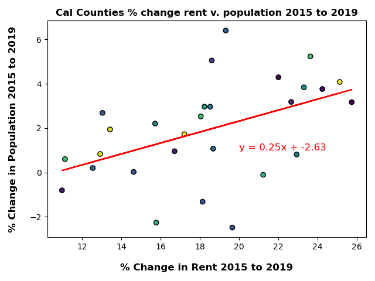

# Project 1 (A Guide to find the area that suits your lifestyle in California)

**Group 4:**
* David Dixon
* Vincent Passanisi
* Cristian Jung
* Ana Gonzalez
* Raphael Quoc Tran
* Daniel Corral

# Introduction

  We have gathered data for you to decide what County better suits YOU. The aim of our project is to uncover various factors to consider when moving to California. We will examine the best choice for living, based on Population, Housing, Employment, and their relationships between regions in California. We have come to the conclusion, based on the data gathered and observed, California is ideal for anyone.

# Files 
  * **Employment/project1.code** - This folder contains all the data observed for Employment in California as well as visualizations for the analysis.
  * **Population** - This folder contains data observed for population by counties for  and Visualizations
  * **Housing** - This folder contains data observed for both rental rates when renting in California, as well median prices for housing in California. Visualizations are also   included.
  * **Resources** - This folder contains csv files as well as any other resources used to gather the information provided.
      * county_list.csv
      * merged_population2.csv
      * County_zori_sm_sa_month.csv
  
# Results

* **POPULATION**

*General Population Analysis

Analysis of population in Californian Counties was done utilizing US Census data. A bar graph was used to compare the population in 2019 for all counties. From the bar graph it is clear that of all California, Los Angeles county is far more populous than any other counties in California.
The bar graph also notes, counties that do not come anywhere close to the population in Los Angeles county.

Population growth was analyzed by finding the difference in population from the years 2010 to 2019. From the calculations, it was derived that overall there was a population growth. It was found that the following 13 counties were shrinking in population: Alpine county, Contra Costa county, Inyo county, Lassen county, Mariposa county, Mendocino county, Modoc county, Plumas county, Sierra county, Siskiyou county, Trinity county, and Tuolumne county.

For comparing the coastal and inland counties, the population data was sorted. In doing so, a pie chart was plotted with 2019 population data, and a bar graph was plotted for population growth between 2010 to 2019. From the pie chart, it can be deducted that Coastal counties are more populous. From the bar graph, it can be deducted that Inland counties had a bigger growth in population. 

*Demographics Analysis

Understanding a demographic of a state can help finalize uncertainty. The state of California has grown an average of 0.5% per year over the last decade of 2010 to 2019. This growth allows for a variety of age groups to be present. Young adults from the age of 20 to newborns are present in larger numbers than adults over the age of 20. In just the male data alone, there is a 4.5% increase in the youth compared to the male adults in a 10 year span.

Now how diverse is the age group for both males and females over the age of 20 as a state? The bar charts show the populace by age and total numbers. The taller bars on the left hand side indicate a balance in adults. The data shows a higher retention for adult males between the ages of 21 to 49. Afterwards, a decline occurs in the amount of males present during the later years of 50. There is a 11% increase in the female population from the age of 50 and older

* **HOUSING**

It is no surprise that the cost of housing in California continues to rise. Factors such as weather, job opportunities, and quality of life are often cited as reasons why people continue to move to the state despite ever increasing cost of living. Are housing costs simply a matter of population rising more quickly than housing can be built? High demand for housing and lagging increases in supply to meet that demand could be one answer. The next few charts look at the median cost of residential rental properties in California by region.

Data on median rents by California county for the years 2015 to 2019 was acquired from Zillow. Counties were categorized by region, and then each given an identifier depending on where the county was located. Counties were identified as inland or coastal, and then again by whether they were in the north, south, or central part of the state.

The first chart shows the cost of residential rental properties for inland counties versus coastal counties for the period 2015 to 2022. Rents for both inland and coastal counties rose steadily from 2015 to 2020, but then accelerated at the beginning of 2020. The increase in cost of inland rentals actually slowed in 2019 but accelerated at the same pace at inland rentals in 2020. Because costs for both increased at relative similar rates, inland properties, which were about 55% the cost of coastal properties, were over 70% of coastal properties by 2022. Inland properties are still a bargain compared to living in coastal counties in California.

The second chart shows median rents broken out by northern, central, and southern regions of the state for the same period of 2015 to 2022. The cost of living in the central part of the state is far less expensive than living in the north which includes Silicon Valley and the San Francisco metropolitan area, or the south which includes Los Angeles, Orange, and San Diego counties. It is interesting to note how median rents accelerated far more quickly than the other regions after 2020.

The final chart in this series seeks to understand if there is a relationship between the percentage increase in rents and the percentage increase in population. This chart looks at the data available between 2015 and 2019. As more data becomes available, it will be interesting to see if the relationship changed after 2020. Available data for the change in median rents in California counties was plotted on a scatter plot against the change in population for the same period. Rents in that time period increased from 11 to almost 26% while the population increased by only 6% in the fasted growing county and decreased by over 2% in the two slowest growing counties.

A line regression was run and plotted with an r-value of 0.48, which is considered a weak correlation.

* **EMPLOYMENT**

The US Census data for job opportunities was utilized for employment analysis. To begin, the data was formatted and cleaned to look at a ten year span from 2010 to 2019. From the ten year span, a beginning (2010), middle (2015) and end year were selected as key points for analysis. The mean, median, variance, standard deviation and SEM were calculated from the three key years. Our cleaned data allowed for us to see the top five counties with the most employment: Los Angeles County, Santa Clara County, Orange County, San Diego County and Alameda County. A bar graph was used to compare the means, medians, variances, standard deviations and SEMs for the five counties  From the bar graph it is clear that of all California, Los Angeles County had the most employed compared to other counties for each respecrtive year.

A bar graph was constructed to focus in on Los Angeles County, the most employed County. For the year 2019, the top five most employed per industry title were Motion Picture and Sound Recording, Private Service Providing, Full-Service Restaurants, Restaurants and Limited-Service Eating Places. Conclusions that were drawn from this analysis and visual is that Los Angeles County has a heavy concentration of workers that are related to food services. The amount of employed in the industry of Motion Picture and Sound Recording reinforces the premotion that many have of the relationship between Los Angeles and media.

# References 
  * **US Census**
  * **Zillow**
  * **California Association of Realtors**

  * **Years referenced** - 
    * Population: 2010-2019 
    * Housing: Median Rents - 2015-2022 / Median Prices of Housing - 2010-2022
